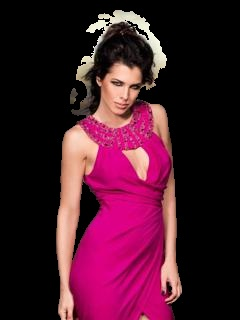

# Отчет по задаче сегментации людей на датасете с соревнования PicksArt Hackathon.

## Датасет

Датасет содержит изображения персон (селфи и в полный рост), размеры изображений 240x320, кол-во изображений 1491. 
Так как разметка есть только для train части, то для своего эксперимента я взял только ее.
Данные - это цветные изображения в jpg и черно-белые маски для них в png (сконвертировал в jpg для удобства).

Наложив маски на изображения и нашлись следующие проблемы в разметке:
1. Слишком больше расстояние между волосами и маской.

  

2. Маска захватыает "пятна" за пределеами человека.

  

Датасет выглядит грязным, было решено поправить разметку.
Данные были разбиты на 3 категории:
1. Изображения на которых разметка выглядит приемлимо (762 изображений)
2. Изображениня, для которых разметку можно быстро поправить (407 изображений/289 размеченно)
3. Изображения, которые править долго и на данный момент я исключу из датасета. (322 изрображений)

После чистки получился датасет размером 1051 изображение: 762 (все из 1-ой категории) + 289 (часть исправленных масок из второй).    
Очищенный датасет был разбит на 3 части: train (900 изображений), val (100 изображений) и test (51 изображение).

## Описание решения

Для решения этой задачи бинарной сегментации была использована архитектура Unet, которая показала себя как хорошее решение не только в задачах [сегментации медицинских изображений](https://arxiv.org/pdf/1505.04597.pdf),
но и ряде других ([Carvana Image Masking](https://www.kaggle.com/c/carvana-image-masking-challenge), [Dstl Satellite Imagery Feature Detection](https://www.kaggle.com/c/dstl-satellite-imagery-feature-detection/),
[TGS Salt Identification Challenge](https://www.kaggle.com/c/tgs-salt-identification-challenge)).

Архитектура Unet состоит из двух частей: encoder и decoder. 
Encoder сворачивает изображение в вектор, а decoder восстанавливает из вектора маску, которая по размеру равна входному изображению.    

К Unet были применены следующие модификации:
1. Encoder часть была заменена на сверточные слои ImageNet pretrained resnet34.
2. Результаты всех слоев decoder block конкатенируются перед подачей на финальные свертки.

Для обучения использовалась функция потерь FocalLoss. В качестве метрики использовался Intersection over Union (IoU).

В процессе обучения применялись слеюущие агументации:
1. HorizontalFlip and VerticalFlip
2. ElasticTransform
3. ShiftScaleRotate
4. JpegCompression
5. RandomBrightnessContrast

Метрики после обучения сети представлены в Таблице 1.    
Таблица 1.

| Train IoU | Validation IoU | Test IoU	|
|-	|-	|-	|
| 0.95586 | 0.94976 	| 0.9453 	|

## Что еще можно попробовать
1. Использовать Lovasz Loss, который позиционируется как сурогатный для оптимизации IoU.
2. Использовать SE слои, сменив backbone на seresnet34 и добавив SE слои в decoder.
3. Использовать в построцессинге маски функции [remove_small_holes](https://scikit-image.org/docs/dev/api/skimage.morphology.html#skimage.morphology.remove_small_holes) и
 [remove small objects](https://scikit-image.org/docs/dev/api/skimage.morphology.html#skimage.morphology.remove_small_objects)

## Сравнение скорости инференса моделей
В таблице 2 приведено сравнение скорости inference pytorch модели и ее оптимизированной trt версии.    
Замеры проводились на GPU RTX2080, CPU: Core i5-6400, bs 1, fp32.    
Таблица 2.

|  	|  mean time (sec)	| std	|
|:-:|:-:|:-:|
| Pytorch model 	| 0.02462 	| 0.04144 	|
| TRT model 	    | TBD       | TBD 	|